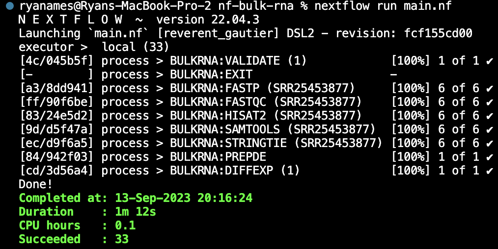

# nf-bulk-rna
A nextflow bulk RNA-Seq processing pipeline

## Overview

This bulk RNA-Seq pipeline consists of:

1. Validation (python)
2. Fastp (quality control)
3. Fastqc (quality assessment)
4. HiSAT2 (alignment)
5. Samtools (post-processing)
6. Stringtie (Expression quanitification)
7. PrepDE (Expression amalgamation)
8. Differential expression (R)

## Test case

Provided with the repo is all the input data that will be needed to successfully run the pipeline:

* metadata.csv
* input-seqs/

The `input-seqs` directory contains 6 samples (subsets) from a publicly available dataset of transcriptomic sequencing of *Candida albicans* treated with artemether grown in spider medium, as well as untreated controls. The data can be found at the [NCBI](https://www.ncbi.nlm.nih.gov/bioproject/PRJNA999911 "PRJNA999911").

## Setup 
Clone the git repo
```
git clone https://github.com/ryanmames/nf-bulk-rna.git
```

Install the necessary conda environments
```
cd conda/
conda env create -f fastp.yaml
conda env create -f fastqc.yaml
conda env create -f hisat2.yaml
conda env create -f python.yaml
conda env create -f samtools.yaml
conda env create -f stringtie.yaml
```
*Note:* Nextflow modules (in the modules directory) will need the `conda` directive modified to include your personal path to the conda installation directory

Install the necessary docker environment
```
cd docker/
docker build -t="ryanames/r-diff-exp" ./
```

## Running the pipeline

Run the `mani.nf` 

```
nextflow run main.nf
```

